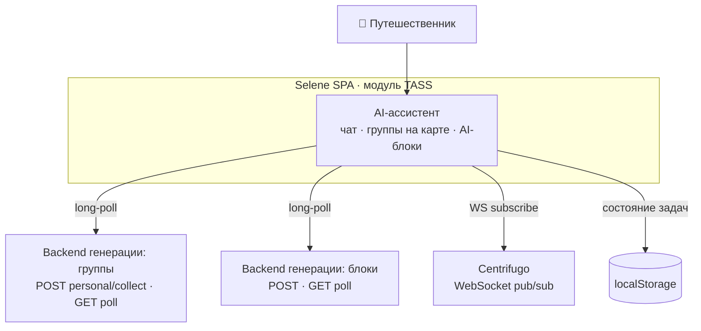

# C4 · Уровень 1 — System Context

Кто пользуется системой и с какими бэкендами она общается. Общий контекст для
текущего и целевого состояния — меняется только внутреннее устройство SPA.

```mermaid
flowchart TB
  user["👤 Путешественник"]
  subgraph spa["Selene SPA · модуль TASS"]
    tass["AI-ассистент<br/>чат · группы на карте · AI-блоки"]
  end
  guides["Backend генерации: группы<br/>POST personal/collect · GET poll"]
  tassbe["Backend генерации: блоки<br/>POST · GET poll"]
  centr["Centrifugo<br/>WebSocket pub/sub"]
  ls[("localStorage")]
  user --> tass
  tass -->|"long-poll"| guides
  tass -->|"long-poll"| tassbe
  tass -->|"WS subscribe"| centr
  tass -->|"состояние задач"| ls
```
